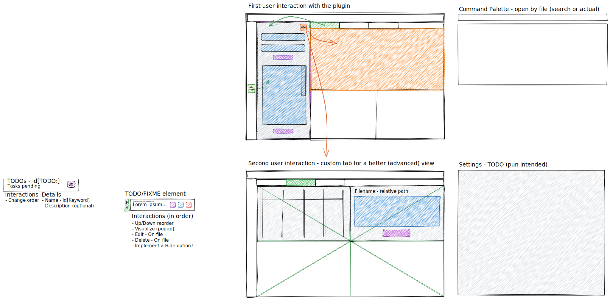

# Svelte the handsome

The canonically socially standard JS/TS framework

## Content

1. [Description](#description)
1. [Tech stack](#tech-stack)
1. [Motivation](#motivation)
1. [Instructions](#instructions)
   1. [How was it created?](#how-was-it-created)
   1. [How to install it](#how-to-install-it)
   1. [How to run it](#how-to-run-it)
1. [Idea][#idea]
   1. [Design](#design)
1. [TODO](#todo)
1. [Credits](#credits)

## Description

[Back to the contents](#content)

As an starting point, I really don't have that much of an idea of what I really want to do with this project, I just want to create something with svelte, I've head it's used for vscode extensions, so maybe I'll do just that.

Deployed at: [https://jofaval.github.io/svelte-the-handsome/](https://jofaval.github.io/svelte-the-handsome/)

- For visual purposes only, won't be functional there

## Tech stack

[Back to the contents](#content)

- Typescript
- Svelte (duh!)
- PNPM (you can use something else, I won't judge, instantly)
- Vite

## Motivation

[Back to the contents](#content)

I wanted to try out Svelte, it feels comfy, nice DX, good set of utilities, and lightweight, I've heard good things, and a compiler/transpiler. I've recently seen a video about comparison with developer satisfaction as one of the metrics, and it did really score well

## Instructions

[Back to the contents](#content)

### How was it created?

[Back to the contents](#content)

Everything you need to build a Svelte project, powered by [`create-svelte`](https://github.com/sveltejs/kit/tree/master/packages/create-svelte).

```bash
# create a new project in the current directory
npm create svelte@latest

# create a new project in my-app
npm create svelte@latest my-app
```

### How to install it

[Back to the instructions](#instructions)

```bash
git clone https://github.com/jofaval/svelte-the-handsome.git
cd svelte-the-handsome
pnpm install
```

### How to run it

[Back to the instructions](#instructions)

```bash
pnpm run dev
```

## Idea

[Back to the contents](#content)

Following the thought that this will be some sort of vscode extension.

Something that would be really nice to sort of integrate in my/any other workflow would be some kind of notebook per file/folder, with the possibility to visualize TODOs, FIXMEs (and custom keywords even) and have some locally stored (at least for now), notepad, per file. That'd be useful, or at least as an idea.

### Design

[Back to the idea](#idea)



## TODO

[Back to the contents](#content)

- [ ] Implement an accesibility strategy (tab key integration, aria-labels, titles, colors, etc.)

## Credits

[Back to the contents](#content)

Ben Awad (I believe it was the first time I've ever heard of Svelte, and good things at that), Jamstack (comparison chart), Netlify, t3dotgg
